<p align="center">
  
  
  = 18" />
  
</p>

<p align="center">
  <picture>
    <source media="(prefers-color-scheme: dark)" srcset="assets/hero-dark.svg" />
    
  </picture>
</p>

<h1 align="center">Google Data Extractor</h1>

<h3 align="center">bulk Google Maps &#8594; Excel &#8212; one profession, up to 1000 areas, zero babysitting</h3>

<p align="center">
  A Chrome extension (Manifest V3) that runs <code>&lt;profession&gt; in &lt;area&gt;</code> across a queue of named areas,
  auto-scrolls every result page until Google stops serving more, de-duplicates the businesses,
  and drops a clean spreadsheet in your downloads.
</p>

## Console

<table align="center">
  <tr>
    <td align="center" colspan="2" width="100%">
      <picture>
        <source media="(prefers-color-scheme: dark)" srcset="assets/queue-dark.svg" />
        
      </picture>
      <br />
      <sub><b>area queue</b> &#8212; up to 1000 areas drain one by one, checkpointed after every area</sub>
    </td>
  </tr>
  <tr>
    <td align="center" width="50%">
      <picture>
        <source media="(prefers-color-scheme: dark)" srcset="assets/map-scroll-dark.svg" />
        
      </picture>
      <br />
      <sub><b>map-scroll</b> &#8212; the feed keeps scrolling until Google stops serving cards</sub>
    </td>
    <td align="center" width="50%">
      <picture>
        <source media="(prefers-color-scheme: dark)" srcset="assets/parser-dark.svg" />
        
      </picture>
      <br />
      <sub><b>parser</b> &#8212; one card &#8594; one clean record, field by field</sub>
    </td>
  </tr>
  <tr>
    <td align="center" width="50%">
      <picture>
        <source media="(prefers-color-scheme: dark)" srcset="assets/dedupe-dark.svg" />
        
      </picture>
      <br />
      <sub><b>dedupe</b> &#8212; the same shop found in two areas is one row</sub>
    </td>
    <td align="center" width="50%">
      <picture>
        <source media="(prefers-color-scheme: dark)" srcset="assets/captcha-dark.svg" />
        
      </picture>
      <br />
      <sub><b>captcha</b> &#8212; blocked? the job stops, you solve it, Resume continues</sub>
    </td>
  </tr>
  <tr>
    <td align="center" width="50%">
      <picture>
        <source media="(prefers-color-scheme: dark)" srcset="assets/watchdog-dark.svg" />
        
      </picture>
      <br />
      <sub><b>watchdog</b> &#8212; a stalled tab is detected and bounced back</sub>
    </td>
    <td align="center" width="50%">
      <picture>
        <source media="(prefers-color-scheme: dark)" srcset="assets/export-dark.svg" />
        
      </picture>
      <br />
      <sub><b>export</b> &#8212; three sheets fill up, then .xlsx / .csv land in downloads</sub>
    </td>
  </tr>
</table>

## /etc/motd

```text
   [ queue ]  ->  [ search ]  ->  [ scroll ]  ->  [ parse ]  ->  [ de-dupe ]  ->  [ export ]
   1000 areas    maps tab      to the end     10 fields     placeId / cid    xlsx + csv

   captcha?   ->  job pauses, you solve it in the tab, Resume keeps the queue
   tab stale? ->  watchdog alarm (60s) bounces it back to the current area
```

## How it works

| Step | What happens |
|------|--------------|
| 1. Queue | You paste area names and one profession. The popup builds a queue of `1..1000` areas. |
| 2. Search | The content script drives the Maps tab area by area, on a human-like delay. |
| 3. Scroll | Each feed is scrolled until the card list stops growing, then every card is harvested. |
| 4. Parse | Name, category, rating, reviews, address, phone, website, plus code, coordinates and place ID. |
| 5. De-dupe | Records collapse on `placeId` / `cid` / name+address+phone — one row per business. |
| 6. Export | Three sheets: **Businesses**, **Areas** (per-area summary) and **Run Summary**. |

## Toolkit

| File | Role |
|------|------|
| `manifest.json` | MV3 manifest — permissions, popup, service worker |
| `popup.html` / `.css` / `.js` | The console: area queue, Start / Pause / Resume / Skip, live counters, preview modal |
| `background.js` | Service worker — token claiming, tab lifecycle, watchdog, export |
| `content.js` | The long-lived orchestrator inside the Maps tab — navigation, scrolling, parsing, self-resume |
| `lib/merge.js` | De-duplication rules + export columns, shared by worker and popup |
| `lib/xlsx.full.min.js` | SheetJS, bundled locally |
| `test/run.mjs` | 285 assertions across 5 suites |

## Install

Clone (or download) this repository, then:

1. Open `chrome://extensions`
2. Enable **Developer mode**
3. **Load unpacked** → pick this folder
4. Pin the extension, open the popup, enter areas + profession, press **Start scraping**

## Tests

```bash
npm i          # optional, only for the jsdom suites
node test/run.mjs
```

285 assertions cover the card parser, the job orchestrator, de-duplication, the service worker and the workbook itself.

## Notes

Unofficial tool, not affiliated with Google. Google Maps data belongs to Google — keep runs reasonable and respect the Terms of Service.
