<p align="center">
  
  
  = 18" />
  
</p>

<p align="center">
  <picture>
    <source media="(prefers-color-scheme: dark)" srcset="assets/hero-dark.svg" />
    
  </picture>
</p>

<h1 align="center">Google Data Extractor</h1>

<p align="center">
  Type <b>dentist in Downtown</b> &#8212; get a spreadsheet.<br />
  A Chrome extension that searches Google Maps across up to <b>1000 areas</b> and exports every business it finds.
</p>

## What it does

- **Search** &#8212; you paste area names and one profession; the extension walks the queue area by area.
- **Scroll** &#8212; each result feed is scrolled to the end, so no card is left behind.
- **Parse** &#8212; name, category, rating, reviews, address, phone, website, plus code, coordinates and place ID.
- **De-dupe** &#8212; the same shop found in two areas becomes one row (`placeId` / `cid` / name+address+phone).
- **Export** &#8212; a `.xlsx` with **Businesses**, **Areas** and **Run Summary** sheets, or plain CSV.

It survives the boring parts too: pauses for a captcha and resumes where you left off, reloads a stalled tab, and checkpoints progress after every area &#8212; a killed service worker never loses a run.

## Install

1. Clone (or download) this repository
2. Open `chrome://extensions` and enable **Developer mode**
3. **Load unpacked** &#8594; pick this folder
4. Pin the extension, open the popup, enter areas + profession, press **Start scraping**

## Tests

```bash
npm i          # optional, only for the jsdom suites
node test/run.mjs
```

285 assertions cover the card parser, the job orchestrator, de-duplication, the service worker and the workbook itself.

## Notes

Unofficial tool, not affiliated with Google. Google Maps data belongs to Google &#8212; keep runs reasonable and respect the Terms of Service.
